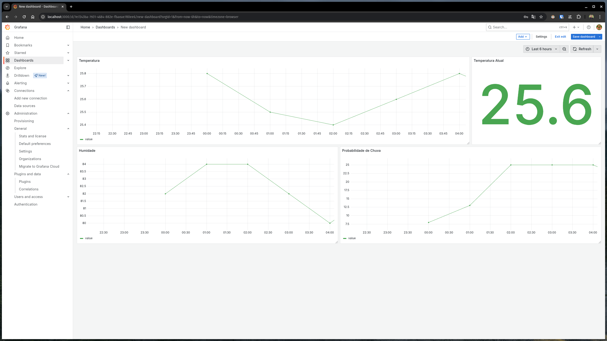

# Weather FIWARE Adapter

A Kotlin-based service that fetches weather forecast data from Open-Meteo and publishes it to FIWARE using the Orion Context Broker. This enables real-time integration of weather data into smart applications and dashboards (via QuantumLeap + CrateDB + Grafana).



## 🧩 Stack

- **Orion Context Broker** – Core FIWARE component for managing context information.
- **QuantumLeap** – Time-series data persistence for Orion.
- **CrateDB** – Time-series database used by QuantumLeap.
- **Grafana** – Dashboard for visualizing data.
- **MongoDB** – Database used by Orion.

## 📦 Docker Compose Setup

This project includes a Docker Compose file to run the entire stack locally:

```bash
docker-compose up -d
```

## Services

- **Orion Context Broker**: `http://localhost:1026`
- **QuantumLeap**: `http://localhost:8668`
- **CrateDB**: `http://localhost:4200`
- **Grafana**: `http://localhost:3000`
- **MongoDB**: `http://localhost:27017`
- **Weather Adapter**: `http://localhost:8080`

## 🌦️ Weather Adapter (Kotlin + Spring Boot)

The Kotlin service connects to [Open-Meteo](https://open-meteo.com/en/docs) and publishes:

- Temperature
- Humidity
- Precipitation Probability
- Rain

## 📊 Viewing the Data in Grafana

1. Open Grafana at `http://localhost:3000`.
2. Log in with default credentials:
   - Username: `admin`
   - Password: `admin
   - Change the password when prompted.
3. Add a new data source:
4. Select "Postgres" and configure it with:
   - URL: `http://create:5432`
   - Database: `doc`
   - Username: `crate`
   - Password: `crate`
5. Save & Test the connection.
6. Create a new dashboard and add panels to visualize the weather data.
7. Use the following queries in this project.

## 🧪 Development

- Docker
- Kotlin
- Spring Boot
- Gradle

## 🛠️ Running the Weather Adapter

```bash
./gradlew bootRun
```

## 📝 License
This project is licensed under the MIT License. See the [LICENSE](LICENSE) file for details.